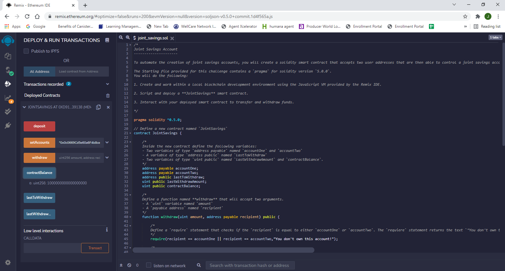
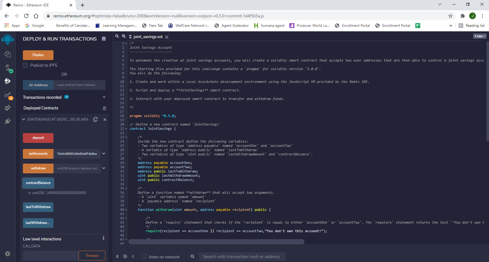
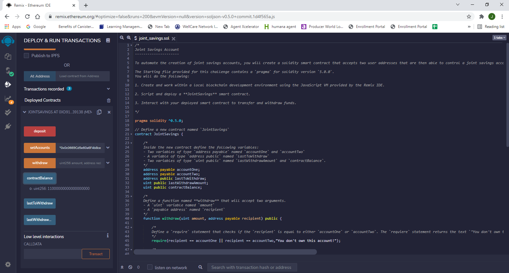

# Smart_Contract

Built a Solidity Smart Contract that accepts two user addresses that are then able to control a joint savings account using ether management functions.

---

## Run Application

Load and deploy the joint_savings.sol file in Remix IDE

---

## Screen Shots

Shows proof of transactions:
1 ether as wei

5 ether as wei

10 ether as wei

---

## Contributors

Jose Medina

---

## License

MIT
